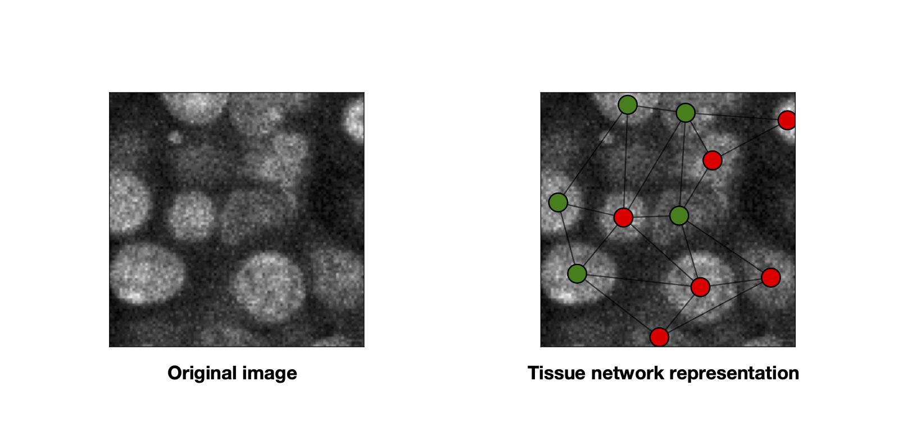

# 🍒  `Griottes` 🍒 

This is **🍒  Griottes🍒** a tool to maximize the amount of information you can extract from your microscopy images.

# Project description

**Griottes** is an easy-to-use, one-stop, Python library to extract single-cell information from your images and return the data in a networkx graph recapitulating the tissue structure.

 - It works on segmented **2D** and **3D** images, no extra fuss required! We like to use [CellPose](https://cellpose.readthedocs.io/en/latest/index.html) for our image segmentation - but that's just a question of taste. You can also use dataframes as inputs.

 - On both **2D** and **3D** images you can easily insert extra information from supplementary fluorescence channels and embed the information on the graph.

**Griottes** allows you to easily generate networks from your image data as shown in the image below.



# Installation

For the moment, only installation via the repository is possible, so you'll have to download it from the command line. In the command prompt enter:

```
git clone https://gitlab.pasteur.fr/gronteix1/spheroid-graphs.git
```

This should download the project. Then install the required packages. In the terminal, navigate to the package directory and type:

```
pip install .
```

The library is now installed on your computer. An example of the library can be accessed [here](Examples/spheroid_analysis_example.ipynb).

# Example

```
test_image # multichannel image


G = griottes.blablabla
```